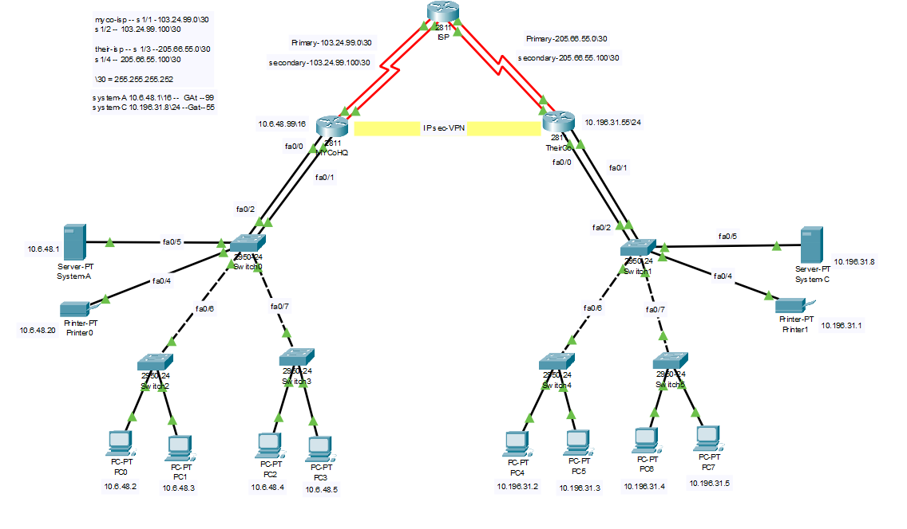

# IPsec VPN Project

Virtual Private Network (VPN) is a secure logical network that a company or user required while confidential data need to be transmitted securely from one device to another over the Internet.

Internet is loaded with unauthorized users trying to break down your company's security and pushing data over such an unsecured network without a VPN or personal leased line would be questionable once the security threat occurs. VPNs have different flavors available for you, so you can find the best solution and implement it into your network for end-to-end security. 

<h3>Project scenario:</h3>
MyCo organisation requires establishing a VPN between a host in its parts division and a host in the manufacturing department of one of their business partners, TheirCo. They only want to create a VPN between System-A and System-C (refer to the figure), so that no other devices from both networks will be connecting except these two. 

</img>

<h3>Solution:</h3>

1) IPsec VPN and ISAKMP policies were created between two routers with Pre-shared Key authentication and encryption (AES 256). 
2) Access-list created to filter the traffic, so only System-A and System-C can connect between these two networks. 
3) Port-Channel had been between Router-to-Switch. for high-speed and redundancy. 
4) Two Serial links have been used to connect with ISP. This will allow high-availability and if one goes down them the other link will be up. To enable this feature, the Administrative Distance of the route of the back-up link was increased. 

<h3>Requirements to run the project:</h3>
Before you download the <a href="https://github.com/Nirali4/Networking_Projects/blob/master/IPSec-VPN/IPsec-VPN-project.pkt">"IPsec-VPN-project.pkt"</a> file, you will require to have Cisco Packet Tracer (Version 7.3 or higher) to run the Project. 

Please note that version lower than 7.3 may not support all the configuration used in this project.  
