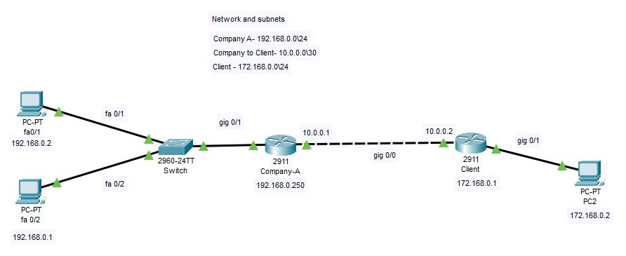

# Port Address Translation
PAT stands for Port Address Translation which is a feature on network devices that allows multiple users to use the same Public IP address from that private network. It is an extended form of Network Address Translation.

As the numbers of the network device are increasing constantly, the demand for the IP addresses is increased too. Hence, the solution for not running out from IP addresses includes PAT, NAT, and IPv6. Use of PAT in the network reduces the operational cost, as the least or no extra IP addresses will require to lease from Internet Service Provides.

<h3>Project scenario:</h3>
A simple network scenario is created to demonstrate how PAT can be implemented on the network. This project also concentrates on features like Dynamic Host Configuration (DHCP) and Access control Lists (ACLs). The DHCP will allow us to automatically provide the IP addresses to the network devices and ACL will make sure that only authorised network/users are accessing the company's network. Simply, ACLs are a type of filtration occurring whenever any packet leaves/enters the private network. 

<h3>Requirements to run the project:</h3>
Before you downloading the <a href="https://github.com/Nirali4/Networking_Projects/blob/master/Network-Port-Address-Translation/Network-Port-Address-Translation.pkt">"Network-Port-Address-Translation.pkt"</a> file, you will require to have Cisco Packet Tracer (Version 7.3 or higher) to run the Project.
